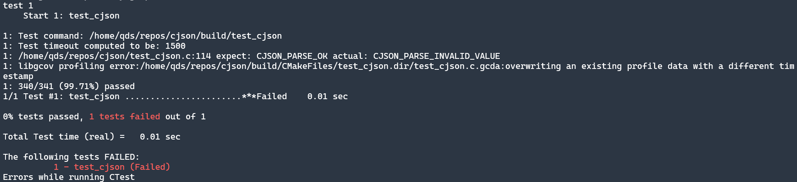

# cjson

  

一个用C编写的JSON解析器和生成器。

代码参考自[json-tutorial](https://github.com/miloyip/json-tutorial)。

## 构建

``` bash
cmake -Bbuild -DCMAKE_BUILD_TYPE=Release
cd build && make
```

## 测试

``` bash
ctest --verbose
```

若添加了`--verbose`选项，当测试失败时会打印造成测试失败的行数、期望值和实际值。如：



## 查看Code Coverage

``` bash
make code_coverage
```

执行命令之后，在`${CMAKE_BINARY_DIR}`目录下会创建一个`code_coverage`目录。在浏览器中打开该目录下的`index.html`，就可以查看测试的code coverage。**需要安装`lcov`**。
